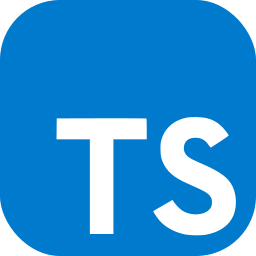

## Hi there, I am Bogdan 👋

I am currently working as a Senior Node.js Engineer.

I have been working with Node.js for over 4 years (previously I worked as a PHP developer) and I am passionate about building scalable and performant web applications. I am also interested in learning new technologies and building things as well as photography and traveling around the world.

Currently I am learning more about rust programming language too in my spare time and I am working on a side project so I can get more familiar with it. My general experience so far it's very positive and I am looking forward to learn more about it.

You can find on my profile two simple CLI projects that I have built using rust so far ([otis](https://github.com/melokki/otis) and [cale-rust](https://github.com/melokki/cale-rust)).

### 🛠️ Tools and technologies I am familiar with:

### 🌱 I’m currently learning:

### 📫 How to reach me:

